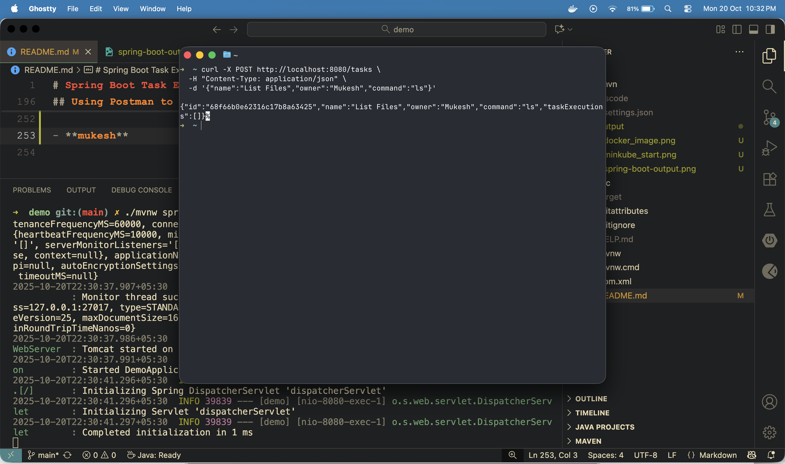

# Spring Boot Task Executor with Kubernetes

## Project Folder Structure

```yaml
├── HELP.md
├── README.md
├── mvnw
├── mvnw.cmd
├── pom.xml
├── src
│   ├── main
│   │   ├── java
│   │   │   └── com
│   │   │       └── example
│   │   │           └── demo
│   │   │               ├── Controller
│   │   │               │   └── TaskController.java
│   │   │               ├── DemoApplication.java
│   │   │               ├── Model
│   │   │               │   ├── TaskExecution.java
│   │   │               │   └── TaskModel.java
│   │   │               ├── Repository
│   │   │               │   └── TaskRepo.java
│   │   │               └── Service
│   │   │                   └── TaskExecService.java
│   │   └── resources
│   │       ├── application.properties
│   │       ├── static
│   │       └── templates
│   └── test
│       └── java
│           └── com
│               └── example
│                   └── demo
│                       └── DemoApplicationTests.java
└── target
    ├── classes
    │   ├── application.properties
    │   └── com
    │       └── example
    │           └── demo
    │               ├── Controller
    │               │   └── TaskController.class
    │               ├── DemoApplication.class
    │               ├── Model
    │               │   ├── TaskExecution.class
    │               │   └── TaskModel.class
    │               ├── Repository
    │               │   └── TaskRepo.class
    │               └── Service
    │                   └── TaskExecService.class
    ├── demo-0.0.1-SNAPSHOT.jar
    ├── demo-0.0.1-SNAPSHOT.jar.original
    ├── generated-sources
    │   └── annotations
    ├── generated-test-sources
    │   └── test-annotations
    ├── maven-archiver
    │   └── pom.properties
    ├── maven-status
    │   └── maven-compiler-plugin
    │       ├── compile
    │       │   └── default-compile
    │       │       ├── createdFiles.lst
    │       │       └── inputFiles.lst
    │       └── testCompile
    │           └── default-testCompile
    │               ├── createdFiles.lst
    │               └── inputFiles.lst
    ├── surefire-reports
    │   ├── TEST-com.example.demo.DemoApplicationTests.xml
    │   └── com.example.demo.DemoApplicationTests.txt
    └── test-classes
        └── com
            └── example
                └── demo
                    └── DemoApplicationTests.class

44 directories, 30 files
```

---

## Features

- Create, update, delete tasks
- Search tasks by name
- Execute shell commands inside a Kubernetes pod
- Log task execution with start time, end time, and output
- Persist tasks in MongoDB

---
## Prerequisites

- Java 17+
- Maven
- Docker
- Minikube
- Kubernetes CLI (`kubectl`)
- MongoDB

---
## Setting up Kubernetes with Docker
 ** To start a Fresh Kubernetes in docker
 ```bash
 minikube start --driver=docker
```

 **Set Docker as Minikube driver**
```bash
minikube config set driver docker
```
- Delete the previous Minikube cluster
```bash
minikube delete
```
- Start Minikube
```bash
minikube start
```
- Check Status
```bash
minikube status
```
- Create a pod
```bash
kubectl run test-pod --image=busybox --restart=Never -- sleep 3600
kubectl get pods -w
```
**PS: this is create pods named *_*test-pod*_* **
- Execute commands inside pod
```bash
kubectl exec -it test-pod -- /bin/sh -c "ls"
```
output for the above:
```yaml
➜  ~ kubectl exec -it test-pod -- /bin/sh -c "ls"

bin    dev    etc    home   lib    lib64  proc   root   sys    tmp    usr  var
```

### RUNNING THE SPRING BOOT
- Start the mongodb
- Clean and build the springboot application
```bash
./mvnw clean install
```
-Run the spring Boot
```bash
./mvnm spring-boot:run
```
-In case of any dependency issue
```bash
./mvnw dependency:resolve
```
Testing the EndPoints
**Create Task**
```bash
curl -X POST http://localhost:8080/tasks \
     -H "Content-Type: application/json" \
     -d '{"name":"List Files","owner":"Mukesh","command":"ls"}'
```
- Run a task in Kubernetes pod
```bash
curl -X PUT "http://localhost:8080/tasks/<task-id>/run?namespace=default&podName=test-pod&containerName=test-pod" \
     -H "Content-Type: application/json"

```
- Get all the Task
```bash
curl http://localhost:8080/tasks
```
- Search tasks by name
```bash
curl http://localhost:8080/tasks/search?name=List
```
- Delete a task
```bash
curl -X DELETE http://localhost:8080/tasks/<task-id>
```
EXAMPLE
```json
{
  "id": "123",
  "name": "Print Hello",
  "owner": "John Smith",
  "command": "echo Hello World!",
  "taskExecutions": [
    {
      "startTime": "2023-04-21T15:51:42.276Z",
      "endTime": "2023-04-21T15:51:43.276Z",
      "output": "Hello World!"
    }
  ]
}
```

## RUN IN POSTMAN
## Using Postman to Test the API

You can test the Spring Boot API endpoints using **Postman**. Below are the main operations:

### 1. Get All Tasks
- **Method:** GET
- **URL:** `http://localhost:8080/tasks`
- **Response:** List of all tasks in MongoDB.

### 2. Get Task by ID
- **Method:** GET
- **URL:** `http://localhost:8080/tasks/{taskId}`
- **Response:** JSON object of the task. Returns 404 if the task does not exist.

### 3. Search Tasks by Name
- **Method:** GET
- **URL:** `http://localhost:8080/tasks/search?name=<name>`
- **Response:** JSON array of matching tasks. Returns 404 if none found.

### 4. Create a Task
- **Method:** POST
- **URL:** `http://localhost:8080/tasks`
- **Headers:** `Content-Type: application/json`
- **Body (raw JSON):**
```json
{
  "name": "List Files",
  "owner": "Mukesh",
  "command": "ls"
}
```
### 1. Update a Task

- **Method:** PUT
- **URL:** `http://localhost:8080/tasks`
- **Headers:**
  - `Content-Type: application/json`
- **Body (raw JSON):** Same format as creating a task, **include the `id`** to update.

Example:

```json
{
  "id": "68f65ea7729d63b9d1cfdaf8",
  "name": "List Files Updated",
  "owner": "Mukesh",
  "command": "ls -l"
}
```
-----------
### SCREENSHOTS
- for docker version


- starting minikube


- see the data

- create new task

